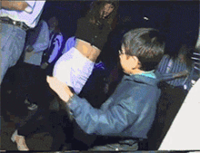

# Crazyflie-Disco-Deck
A repository for transforming your Crazyflie into a party drone.

  

  

## Ingredients
 - 1 Crazyflie platform
 - 1 Color LED deck (bottom)
 - 1 [Sub-Micro Plastic Planetary Gearmotor](https://www.pololu.com/product/2358)
 - 2 KA 1.7×6 screws
 - 1 rubber band
 - 1 3D printer

 ## Process
 - Print the parts found in [mechanics](/mechanics/)
 - Assmeble the Disco deck and mount it underneath the Crazyflie
 - Connect the motor as described in [electronics](/electronics/)
 - Modify the [firmware](/firmware/) and flash it to the Crazyflie