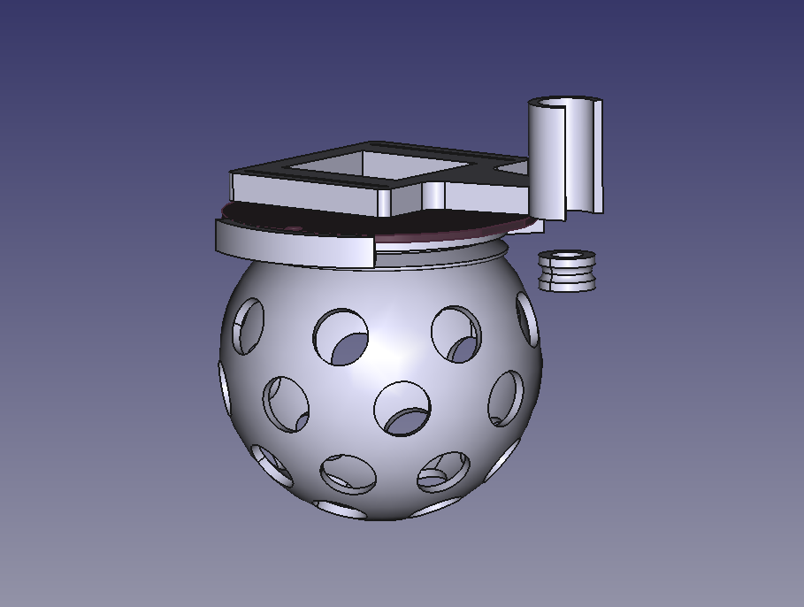

# Mechanics

- All parts were designed to be easy to 3D print with PLA.
- The **Disco_base** parts are attached to the Color LED deck's PCB using two **KA 1.7×6** screws.
- The rubber band is wrapped around the motor-spool and the disco-ball.

  

